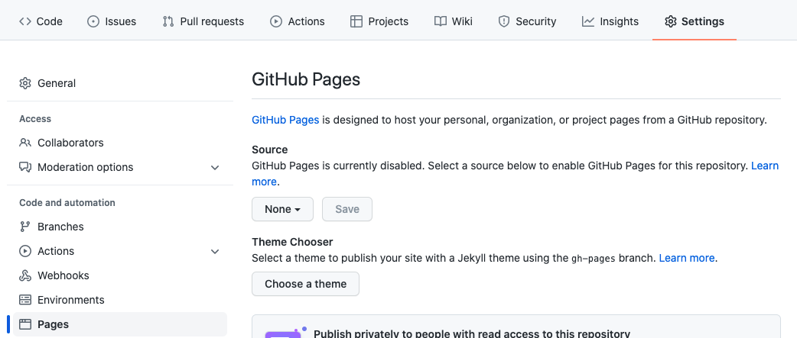

Your final project files (html, css, images, etc) should go in this folder. **One of those files should be called index.html**: it will become your landing page. Otherwise, your site will land on this readme; probably not what you intended!

You can then publish this site to the open web: First, go to your repository's Settings and select "Pages" in the margin.

Then change the source from "none" to the "main" branch, and change the folder from "root" to "docs".

This is a default configuration; note that you could choose other branches, or other folders. But main > docs should work for now!

Your default URL, for a repository located at https://github.com/_username_/_reponame_, will then be https://_username_.github.io/_reponame_. (See how our course website uses the same structure?) Note that if you put index.html in a subfolder rather than directly in docs, you'll need to add to that default URL to find your real homepage: https://_username_.github.io/_reponame_/_subfoldername_.
